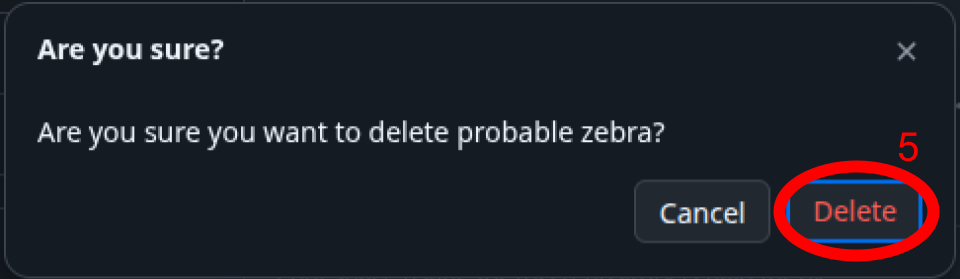

# Editing Documentation
0. learn markdown
    - [Interactive Markdown Tutorial](https://www.markdowntutorial.com/)
    - [Github Flavored Markdown (GFM) Documentation](https://github.github.com/gfm/)
    - [GFM Cheat Sheet](https://gist.github.com/Myndex/5140d6fe98519bb15c503c490e713233)
    - [Standard Markdown Cheat Sheet](https://www.markdownguide.org/cheat-sheet/)
1. create github codespace
    - if one is already open, ignore it or consult with your team before removing it
    - otherwise, create a new codespace by:

        
    <!-- no, i dont in fact like that i have to space the image this way but it doesnt render correctly if i dont -->
    1. clicking the green "Code" button
    2. clicking the "Codespaces" tab within the "Code" dialog
    3. clicking the plus button under codespaces tab
2. edit markdown (`.md`) files
3. save and commit changes
    1. run `git add .` in the terminal
    2. run `git commit` in the terminal
    3. under the newly created "COMMIT_EDITMSG" tab, describe the changes you made
    4. click the checkmark to confirm changes and their description
    
4. run `git push` to sync your changes with the main documentation
5. delete your codespace when you are finished editing

    
    <!-- another horrible spacing image rendering thing ughhhhh i hate this -->
    1. click the green "Code" button
    2. click the "Codespaces" tab within the "Code" dialog
    3. click the 3 horizontal dots next to your workspace
    4. click the "Delete" button to delete the workspace
    5. click "Delete" in the "Are you sure?" popup window to confirm the codespace deletion 
    
